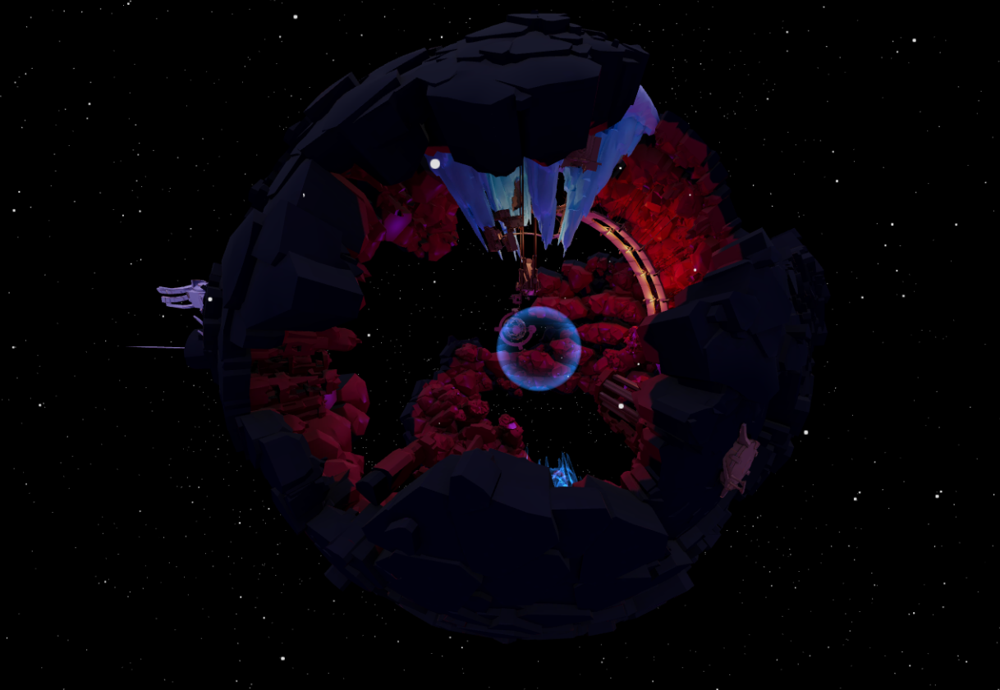

<!--
 * @Descripttion: 
 * @version: Chevalier
 * @Author: 
 * @Date: 2024-08-19 09:18:36
 * @LastEditors: Chevalier
 * @LastEditTime: 2024-08-19 15:59:02
-->
# r3f-vite-theatre
A boilerplate to build R3F projects

```
npm
npm run dev
```





# leva threejs >155 , leva .35 需要
```json
"overrides": {
    "leva": {
      "@radix-ui/react-portal": "1.0.2"
    }
  }
```
